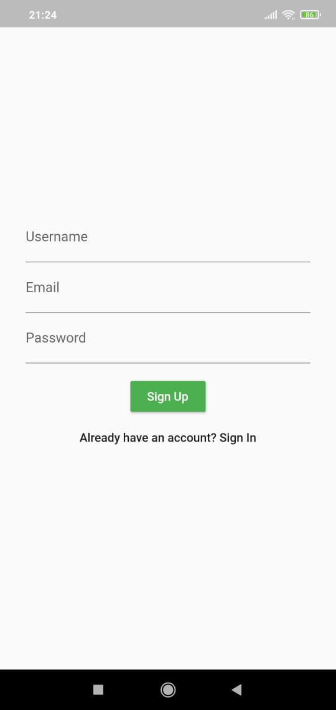
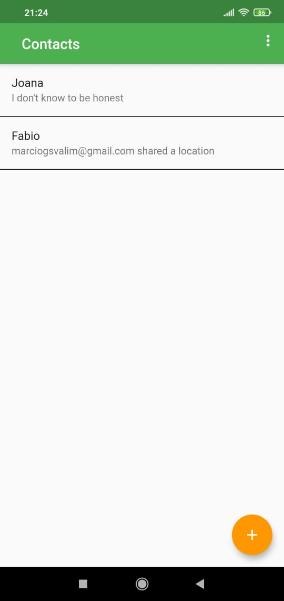
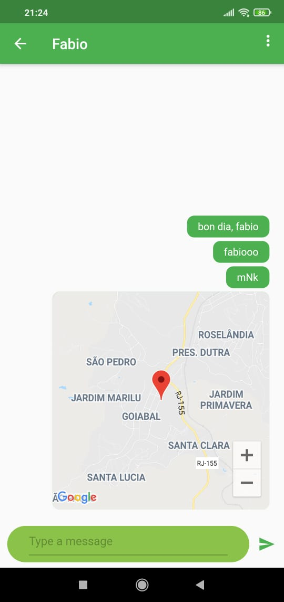

# Flutter Chat App

A whatsapp like chat app made with Flutter and Firebase.

  
  
  

## Getting Started

Note: You already need to have Flutter installed.

<pre>
# clone the repo
git clone https://github.com/marciovalim/flutter-chat-app.git 

# move to the cloned repo
cd flutter-chat-app

# get dependencies
flutter pub get

# run application
flutter run
</pre>

## 📝 License

This project is under MIT License. See <a href="https://github.com/marciovalim/flutter-chat-app/blob/master/LICENSE">LICENSE</a> for more details.
